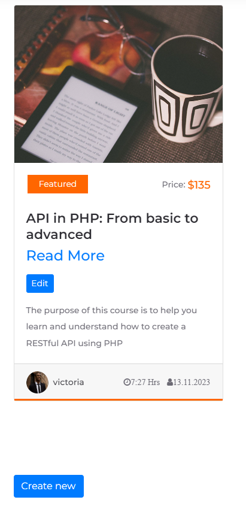

# Online-Learning-Platform

[](URL)
[](URL)
[](URL)

## Overview

Welcome to Online Learning Platform Documentation, where knowledge meets convenience. Online Learning Platform offers a seamless experience for both students and instructors, fostering a dynamic learning environment.


This project helped me to learn and understand how to create and use Symfony Framework, Bundles and Migrations.


## Table of Contents

- [Requirements](#requirements)
- [Features](#features)
- [Getting Started](#getting-started)
- [Authentication](#authentication)
- [Layout](#layout)
- [Project Demo](#project-demo)


## Requirements

- PHP 8.1/8.2
- [Symfony](https://symfony.com/)
- [Docker](https://www.docker.com/products/docker-desktop/)

## Features
- **Authentication:** The user have to be fully authenticated in order to have access to all the features presented in this application.
- **Customizable:** Customize your profile page. Additionally, the users with instructor or admin roles has the authority to create, update, delete courses and lessons.
- **Detailed Documentation:** Easy-to-follow documentation and layouts for quick integration.


## Getting Started

To get started with this application, follow these steps:

1. **Clone the repository**: Clone this repository to your local development environment.
```bash
git clone https://github.com/Victoria-ElenaLazar/Online-Learning-Platform.git
```
1 **Install dependencies**: navigate to your project root directory and install
the required dependencies using Composer.
```bash
composer install
```
2 **Configuration**: Modify your compose.yml file as needed.

3 **Configure Environment**: Create an '.env.local' file and configure your database settings.

4 **Database Setup**: The "Entity" folder contains necessary ORM Mapping. Run the following command:

```bash
docker exec -it online_learning_platform_php bash
```
following by:

```bash
php bin/console doctrine:database:create
```
Now the database is created and you need to create some table inside. Run the following command in terminal inside your application:
```bash
php bin/console make:migration
```
Confirm the migration, then run:
```bash
php bin/console doctrine:migrations:migrate
```
Now you have the database with specific tables.


## Authentication

You will have limited access on the Home Page. In order to have full access you have to register and to log in.

**'Authorization'** Create an account by clicking the 'Register' button, top-right corner:

 **Sign-in**: Sign-in with your credentials. You'll be redirected to Home Page.

# Layout

## For Students

- **Enroll in Courses:** Browse through a diverse range of courses, enroll with a click, and embark on your learning journey.


  


- **Start Lessons:** Access engaging lessons, learn at your own pace, and track your progress effortlessly.


  


- **Create Profile:** Personalize your learning experience by creating a profile that reflects your academic journey.


  


- **Course Management:** Easily exit from courses you've completed or wish to discontinue.

- **Limited Access:** Enrollment is an important step for students in order to see the content of the course.


  


## For Instructors

- **Course Creation:** Empower others by creating comprehensive courses tailored to your expertise.


  


- **Lesson Management:** Add, edit, update, or remove lessons to keep your content current and engaging.


  


- **Create Profile:** Personalize your learning experience by creating a profile that reflects your academic journey.

## For Admins

- **Full Control:** Admins have the power to perform all actions available to instructors, ensuring the smooth operation of the platform.
- **Statistical Insights:** Gain valuable insights into platform usage, course popularity, and student engagement through the admin panel.


  


- **Create Profile:** Personalize your learning experience by creating a profile that reflects your academic journey.


## Project Demo

[Watch the video](public/uploads/OLP.mov)

Or [download the video](public/uploads/OLP.mov) to watch it.


